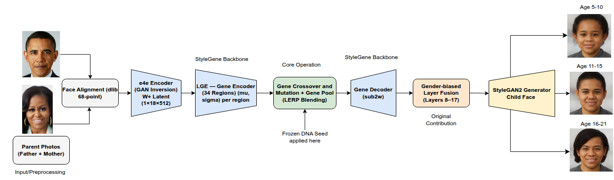

# KinshipForge

**Age-progressive child face synthesis from parental images**  
Built on StyleGene (CVPR 2023) · Kaggle T4 GPU · Gradio UI

*Research Internship — IIT Bhilai MIST Lab · B.Tech CSE (AI), CSVTU Bhilai*

---

## What This Project Does

KinshipForge extends the StyleGene framework to generate one consistent 
child face at three age stages — 5-10, 11-15, and 16-21 years — from 
just two parent photographs. Unlike the original StyleGene paper which 
generates 40 independent sibling-like children per pair, this project 
maintains identity consistency across all three age outputs using a 
frozen DNA seed approach.

---

## Pipeline



---

## Five Original Contributions

| Contribution | Description |
|---|---|
| Frozen DNA Seed | Fixes crossover weights (α, β) across all 3 age stages — same genetic blueprint, visible aging via pool variation |
| LERP Bucket Blending | Linearly interpolates FFHQ pool age buckets to create intermediate age genes for each output stage |
| Gender-biased Layer Fusion | 70/30 father/mother weighting on StyleGAN2 layers 8-17 for male, 30/70 for female — replaces paper's fixed 50/50 |
| Multi-seed Selection | Runs seeds [42, 123, 256], selects seed with maximum LPIPS age progression — improved mean LPIPS from 0.207 to 0.267 |
| Gene Pool Rebuild | Rebuilt researchers' 27.8 GB inaccessible pool from FFHQ 70k — 56 keys, 100 samples/bucket, 8.71 GB |

---

## Results


Evaluated on 7 parent pairs across 5 ethnicities including Indian pairs 
absent from all existing benchmark datasets. Real child photographs used 
as ground truth for all 7 pairs.

| Metric | Mean | Threshold | Pairs above threshold |
|---|---|---|---|
| SSIM vs real child | 0.282 | 0.25 | 6/7 |
| LPIPS age progression | 0.251 | 0.20 | 6/7 |
| ArcFace identity consistency | 0.393 | 0.25 | 7/7 |

---

## Setup and Usage

### 1. Clone the repo
```bash
git clone https://github.com/YOUR_USERNAME/KinshipForge.git
cd KinshipForge
```

### 2. Clone StyleGene and install dependencies
```bash
git clone https://github.com/CVI-SZU/StyleGene.git
pip install -r requirements.txt
```

### 3. Download model checkpoints
Checkpoints available at HuggingFace:  
https://huggingface.co/wmpscc/StyleGene_CKPT

Download these 5 files to `/tmp/ckpt/`:
- `e4e_ffhq_encode.pt`
- `stylegan2-ffhq-config-f.pt`
- `stylegene_N18.ckpt`
- `res34_fair_align_multi_7_20190809.pt`
- `shape_predictor_68_face_landmarks.dat.bz2`

### 4. Download Gene Pool
Custom rebuilt gene pool (8.71 GB):  
https://www.kaggle.com/datasets/manaswimendhekar/stylegene-balanced-pool

Note: Due to data privacy and storage constraints, this Kaggle dataset is currently set to Private. Access can be granted to the evaluation committee upon request.

Access Request: This dataset contains sensitive biometric-derived feature pools and is currently set to Private to comply with data privacy policies. Authorized researchers and evaluation committee members may request access by sending their Kaggle username to the project maintainer.

Place at: `YOUR_DATASET/pool_50samples.pkl`

### 5. Run the Gradio UI
```bash
python child_face_gradio_ui.py
```

### 6. Or run the full notebook on Kaggle
Open `kinshipforge_notebook.ipynb` on Kaggle with T4 GPU enabled.  
Update dataset paths from `YOUR_DATASET` to your actual Kaggle dataset paths.

---

## Dataset Paths (Kaggle)

| Dataset | Path |
|---|---|
| Parent/child photos | YOUR_DATASET/locked-7-pairs/ |
| Gene Pool | YOUR_DATASET/stylegene-balanced-pool/pool_50samples.pkl |
| FFHQ 70k thumbnails | YOUR_DATASET/ffhq-face-data-set/thumbnails128x128/ |

---

## Known Limitations

- Age floor: StyleGAN2 trained on FFHQ lacks child faces below age 15 — outputs appear slightly older than target
- Indian female pool critically sparse: 0-2-female-Indian has only 1 sample due to FFHQ bias toward Western faces
- Mixed-race pool query: only first parent's race used for mutation (known bug, future fix)
- FairFace unreliable on celebrity photos — race labels hardcoded for all 7 evaluation pairs

---

## References

1. Li et al., "StyleGene: Crossover and Mutation of Region-level Facial Genes for Kinship Face Synthesis," CVPR 2023
2. Richardson et al., "Encoding in Style: a StyleGAN Encoder for Image-to-Image Translation," CVPR 2021
3. Karras et al., "Analyzing and Improving the Image Quality of StyleGAN," CVPR 2020
4. Kärkkäinen and Joo, "FairFace: Face Attribute Dataset for Balanced Race, Gender, and Age," WACV 2021
5. Deng et al., "ArcFace: Additive Angular Margin Loss for Deep Face Recognition," CVPR 2019
6. Zhang et al., "The Unreasonable Effectiveness of Deep Features as a Perceptual Metric," CVPR 2018

---

## Acknowledgements

Research internship conducted at MIST Lab, IIT Bhilai under the guidance 
of Dr. Sk. Subidh Ali (Associate Professor, Dept. of CSE, IIT Bhilai).  
University mentor: Dr. Dipti Verma (Assistant Professor, CSVTU Bhilai).  
Built on the StyleGene codebase by Hao Li et al., Shenzhen University.
